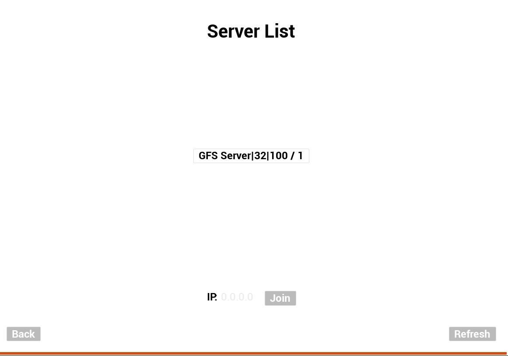

# UE_Network_Lab | "The Control Lab"


A networked party-game template and experimental testbed for multiplayer gameplay engineering.
Assignment 1 submission branch prepared for pull request.
[](https://opensource.org/licenses/MIT)

## 📖 About The Project

This repository contains the Unreal Engine project framework for **The Control Lab**, a networked party-game collection. It serves as the foundational template to engineer individual networked experiments (minigames) within a shared ecosystem.

Key features include a pre-configured **Server Browser**, **Host/Join functionality**, and a standardized **Input Schema** designed for rapid prototyping of multiplayer mechanics. Each experiment is designed as a "test chamber" where players compete to survive under a strict 60-second "Pass/Fail" loop.

---

## 🚀 Getting Started

Follow these instructions to get a copy of the project up and running on your local machine for development and testing.

### Prerequisites

* **Unreal Engine 5.4.4** (or newer).
* **Visual Studio 2022** with "Game development with C++" and "Unreal Engine installer" workloads.
* **Git** (for cloning the repository).
* **Epic Games Launcher** installed.

### Installation

1. **Clone the repository:**
    ```sh
    git clone https://github.com/your-username/UE_Network_Lab.git
    ```

2. **Open the Editor:**
    Double-click `UE_Network_Lab.uproject` to launch the Unreal Editor.

---

## ✨ Technical Standards

To ensure your experiment integrates with the Lab ecosystem, you must adhere to the following technical standards.

### 🎮 Input Schema
All experiments must use the following button mapping schema to maintain compatibility:

| Action | Key (KB/M) | Controller |
| :--- | :--- | :--- |
| **Move** | WASD | Left Stick |
| **Look/Rotate** | Mouse | Right Stick |
| **Menu Move** | Arrow Keys | D-Pad |
| **Action A: Activate** | E | Left Button |
| **Action B: Dash/Cancel** | Shift | Right Button |
| **Action C: Jump/Select** | Space | Bottom Button |
| **Action D: Special** | Mouse 0 | Top Button |
| **Action E: Pause** | Esc | Start |

### 🧪 Game Rules & Aesthetics
* **60-Second Loop:** The experiment must resolve to a **Pass/Fail** state within 60 seconds.
* **State Reset:** The system must automatically reset the `GameState` after the test concludes.
* **Visuals:** Use a strict "Testing Facility" style. Stick to simple geometric shapes and the provided **Lab White** and **Hazard Orange** materials.

---

## 🛠️ Usage

### Creating a New Experiment (Map)
Level contributions must follow the strict folder and naming structure located in `Content/Experiments/`.

1. **Duplicate the Template:**

   Navigate to `Content/Experiments` and Create a new folder, then group select and drag the Template_Game_Map, Template_Game_Data, template_game_thumbnail onto the new created folder and select copy.

2. **Rename Assets:**
   Inside your new folder, rename the three core assets to match your project:
   * `Template_Game_Data` → `My_Minigame_Data`
   * `Template_Game_Map` → `My_Minigame_Map`
   * `template_game_thumbnail` → `my_minigame_thumbnail`

3. **Configure the Experiment Data:**
   Open your duplicated `Data Asset` (Primary Data Asset class: `PDA_ExperimentDef`) and fill out the following fields in the **Details** panel:
   * **Experiment Name:** The display name of your game.
   * **Student Author:** Your name or group ID.
   * **Level File:** Link your specific `_Map` asset here.
   * **Thumbnail:** Link your specific `_thumbnail` texture here.
   * **Experiment ID:** Assign a unique integer (check with your instructor for the current ID range).

### Main Maps
* **MainMenu:** The default entry point for hosting or joining sessions.
* **Template_Game_Map:** The primary testing environment for networked gameplay which should be duplicated and built upon.

**Template_Game_Map Features:**

* The template map does have some very basic features added such as press "esc" or "1" key to exit the session. This is located inside the 3rd Person Blueprint.
* Orange cubes have movement replication set, so all connected users can view the translation and physics. 
* Blue cubes do not have network replication turned on, and will suffer from network sync issues. 
* You must edit a duplicated version of this map template and implement relevent replication features for a party game.

---

## 🤝 Contributing

This project is an educational framework. If you find bugs in the core networking or lobby systems, please fork the repo and create a pull request.

1. Fork the Project
2. Create your Feature Branch (`git checkout -b feature/AmazingFeature`)
3. Commit your Changes (`git commit -m 'Add some AmazingFeature'`)
4. Push to the Branch (`git push origin feature/AmazingFeature`)
5. Open a Pull Request

---

## ❓ FAQ

### What is the default entry point?
The default starting map is located at `Content/Core/Maps/MainMenu`. Always ensure you begin from this scene to correctly initialize the network session manager.

### How do I host a session?

To host a game:
1. Select **Host** from the main menu.
2. Enter a **Server Name** (required).
3. Select your desired experiment from the list of available maps.
4. Click **Start** to initialize the server.

### How do I join a session?

You can join an existing session in two ways:
1. **Server List:** Select **Join** to view a list of available servers on your local network. The list will periodically refresh.
2. **Manual Join:** If the server list is empty, you can manually enter the **Host IP Address** to connect directly.

### I can't see any servers in the list. What's wrong?
* **Patience:** It can take 20-30 seconds for the network to broadcast and discover active sessions.
* **Manual Refresh:** If nothing appears after 30 seconds, click the **Refresh** button manually.
* **Network Restrictions:** On certain environments (like corporate or university networks), automatic network scanning/UDP broadcasting may be blocked. In these cases, you must use the **Manual Join** option with the host's local IP address.

### The game didn't reset after 60 seconds.
Ensure your experiment's logic correctly calls the reset event in the `GameState`. Every experiment must adhere to the 60-second Pass/Fail loop and trigger an automatic reset to return to the lobby or restart the test.

---

## 📜 License

Distributed under the MIT License. See `LICENSE.txt` for more information.

---

## 📞 Contact

**Josh Hall** – Griffith University – [joshua.hall@griffith.edu.au]

Project Link: [https://github.com/your-username/UE_Network_Lab](https://github.com/your-username/UE_Network_Lab)

---

## Attribution
This project utilises the following third-party resources:

* **[Advanced Sessions Plugin](https://vreue4.com/advanced-sessions-binaries)**: Created by **mordentral**. This plugin provides the extended blueprint functionality for session management, server searching, and networking metadata used in this template.