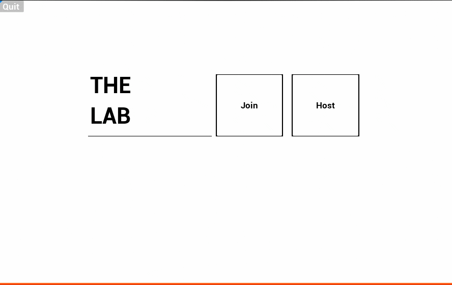
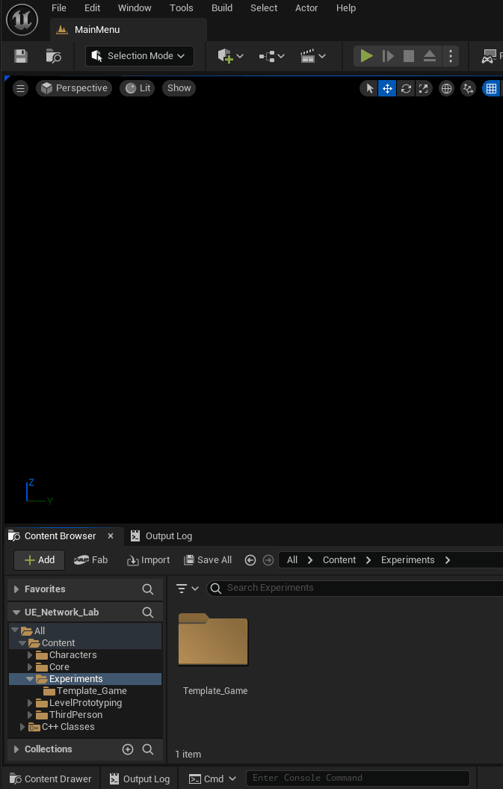
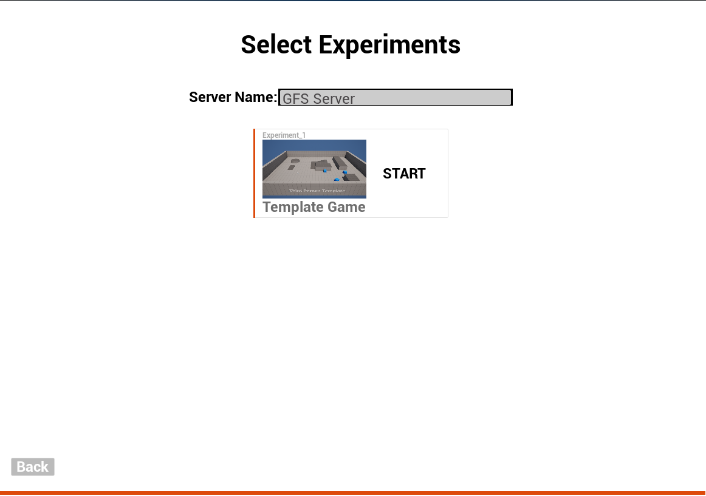

# UE_Network_Lab | "The Control Lab"

A networked party-game template and experimental testbed for multiplayer gameplay engineering.

## 📖 About The Project

This repository contains the Unreal Engine project framework for **The Control Lab**, a networked party-game collection. It serves as the foundational template to engineer individual networked experiments (minigames) within a shared ecosystem.

Key features include a pre-configured **Server Browser**, **Host/Join functionality**, and a standardised **Input Schema** designed for rapid prototyping of multiplayer mechanics. Each experiment is designed as a "test chamber" where players compete to survive under a strict 60-second "Pass/Fail" loop.

---

## 🚀 Getting Started

Follow these instructions to get a copy of the project up and running on your local machine for development and testing.

### Prerequisites

* **Unreal Engine 5.4.4** (or newer).
* **Visual Studio 2022** (Windows) or **Xcode** (macOS) with C++ development support.
* **Git** (for cloning the repository).
* **Epic Games Launcher** installed.

### Installation
1. **Fork the repo:**
Best to Fork the repo first to your own repository, then clone to work on it locally.

3. **Rebuild the project:**
Before opening, right click on the UE_Network_Lab.uproject, and select "Generate Visual Studio Project Files". You should see new UE_Network_Lab.sln file appear.

3. **Rebuild the Project:**
    Double-click `UE_Network_Lab.uproject` to launch the Unreal Editor. You may be prompted to rebuild the project as the Advanced Session Plugin may require it. If you get an error during this stage, try to open the UE_Network_Lab.sln file in visal studio 2022, and rebuild the project using "Development Editor" build configuration.
The **Advanced Sessions Plugin** is included in the `Plugins/` directory and should initialise automatically.

4. **Open the Project:**
Once this is done, you should be able to either double click on the UE_Network_Lab.uproject or open it via the Epic Games Launcher.

---

## ✨ Technical Standards

To ensure your experiment integrates with the Lab ecosystem, you must adhere to the following technical standards.

### 🎮 Input Schema
All experiments must use the following button mapping schema to maintain compatibility across different levels:

| Action | Key (KB/M) | Controller |
| :--- | :--- | :--- |
| **Move** | WASD | Left Stick |
| **Look/Rotate** | Mouse | Right Stick |
| **Menu Move** | Arrow Keys | D-Pad |
| **Action A: Activate** | E | Left Face Button |
| **Action B: Dash/Cancel** | Shift | Right Face Button |
| **Action C: Jump/Select** | Space | Bottom Face Button |
| **Action D: Special** | Mouse 0 | Top Face Button |
| **Action E: Pause** | Esc | Start/Menu |

### 🧪 Game Rules & Aesthetics
* **60-Second Loop:** The experiment must resolve to a **Pass/Fail** state within 60 seconds.
* **Visuals:** Use a strict "Testing Facility" style. Stick to simple geometric shapes and the provided **Lab White** and **Hazard Orange** materials. This ensures project size remains small and performance remains high.
* **Naming Conventions:** Follow industry-standard **PascalCase** for all assets (e.g., `BP_Experiment_CharacterName`, `M_Lab_Floor`).

---

## 🏗️ Core Architecture & Networking

The Lab uses a robust state-driven architecture to manage multiplayer sessions.

### Experiment States (`EControlLab_ExperimentState`)
  
The `EControlLab_ExperimentState` enum in the **GameState** controls the flow of the game:
*   `MainMenu`: Initial state for server discovery.
*   `GameLobby`: Players wait for the host. The **Start** button is only visible to the **Host** and becomes active once 2 or more players have joined.
*   `GamePlaying`: The active experiment loop. 
*   `GamePaused`: The active experiment loop. 
*   `GameOver`: Triggered when the timer hits zero or a player wins.

### Game State
The game state base class will have some key variables used to drive gameplay. However this game state can be overriden with changes to the default values or add further functionality/variables.  
  
Base Variables include:  
*   **remainingTime (float):** Stored in the `GameState`. This uses **RepNotify** (`OnRep_RemainingTime`) to ensure every client's `WBP_HUD_TIMER` is synchronised with the server's authoritative clock.
*   **winnerID (int):** Defaulting to `0` (no winner), this is updated on the Server and replicated to all clients to display the victory screen.
*   **experimentState (EControlLab_ExperimentState):** Defaulting to `MainMenu`, this is updated on the Server and replicated to all clients. Bind events to this to trigger GUI Widgets. Or Set this variable to trigger game state change e.g. game over.
*   **Session Cleanup:** If the **Host** exits the session, a custom cleanup event triggers to return all connected clients back to the Main Menu automatically.

---

## 🛠️ Usage

### Creating a New Experiment (Map)
Level contributions must follow the folder and naming structure located in `Content/Experiments/`.

1. **Duplicate the Template:**

   Navigate to `Content/Experiments/Template_Game`. Create a new directory for your experiment. Group-select and drag the template assets onto your new folder and select **Copy Here**.

2. **Rename and Organise Assets:**
   Inside your new folder, rename assets using the experiment prefix (e.g., `MyMinigame`):
   * `Template_Game_Map` → `MyMinigame_Map`
   * `Template_Game_Data` → `MyMinigame_Data`
   * `template_game_thubnail` → `MyMinigame_Thumbnail`

   **Crucial Step:** To modify specific rules or characters, you must also copy and rename:
   * `BP_Template_Game_GameState` → `BP_MyMinigame_GameState`
   * `BP_Template_Game_PlayerController` → `BP_MyMinigame_PlayerController`
   * `BP_Template_Game_ThirdPersonCharacter` → `BP_MyMinigame_ThirdPersonCharacter`

3. **Configure the Experiment Data:**
   Open your duplicated `Data Asset` (`PDA_ExperimentDef`) and complete the **Details** panel:
   * **Experiment Name:** The display name shown in the browser.
   * **Student Author:** Your name or group ID.
   * **Level File:** Link your specific `_Map` asset.
   * **Thumbnail:** Link your `_Thumbnail` texture.
   * **Experiment ID:** Assign a unique integer (consult your instructor for the current range).

### Map World Settings

After duplicating the template map, open **World Settings** and ensure the **GameMode Override** is set to a GameMode class that uses your new character and state classes. 

### GameMode Settings

When you are using a new custom game mode, also ensure you select custom: 
* Game State Class
* Player Controller Class
* Player State Class
* Default Pawn Class

This allows you to modify the inherited classes for custom game behaviour.

---

## ❓ FAQ

### What is the default entry point?
The default starting map is `Content/Core/Maps/MainMenu`. Always begin from this scene to correctly initialise the network session manager.

### How do I host a session?

1. Select **Host** from the main menu.
2. Enter a unique **Server Name**.
3. Select your experiment from the list.
4. Click **Start** to initialise.

### Why can't I see any servers?
*   **Patience:** Broadcast discovery can take up to 20-30 seconds.
*   **Manual Join:** On restricted networks (like University Wi-Fi), use the **Manual Join** option with the host's local IP address.

### The game didn't reset after 60 seconds.
Ensure your experiment's logic sets the `EExperimentState` to `GameOver` when the `remainingTime` reaches zero on the Server.

---

## Known Issues
This is an early preview project, so it will come with some outlier bugs and usability issues. If you find a bug or have a recommendation, please follow the "Contributing" section below to make a change or suggestion.

---

## 🤝 Contributing

This project is an educational framework. If you find bugs in the core networking or lobby systems, please fork the repo and create a pull request.

1. Fork the Project
2. Create your Feature Branch (`git checkout -b feature/AmazingFeature`)
3. Commit your Changes (`git commit -m 'Add some AmazingFeature'`)
4. Push to the Branch (`git push origin feature/AmazingFeature`)
5. Open a Pull Request (PR)
6. The team will review your PR and accept or provide feedback before merging.

---

## 📜 License

Distributed under the MIT License. See `LICENSE.txt` for more information.

---

## 📞 Contact

**Josh Hall** – Griffith University – [joshua.hall@griffith.edu.au]

Project Link: [https://github.com/josh-hall-griffith/UE_Network_Lab](https://github.com/josh-hall-griffith/UE_Network_Lab)

---

## Attribution
This project utilises the following third-party resources:

* **[Advanced Sessions Plugin](https://vreue4.com/advanced-sessions-binaries)**: Created by **mordentral**. This plugin provides the extended blueprint functionality for session management, server searching, and networking metadata used in this template.